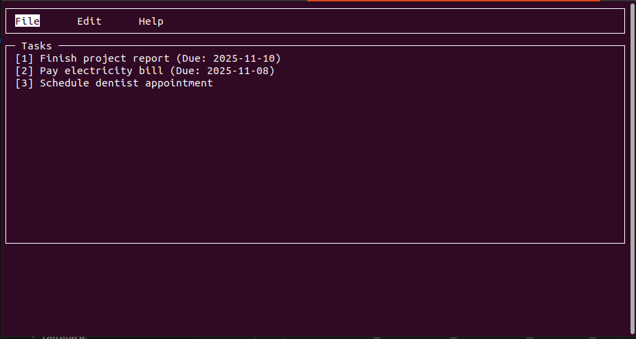

# MyBuddy

A simple terminal-based task manager with a GUI-like interface using **ncurses** in C++. Features a menu bar with keyboard and mouse navigation.

## Screenshot




## Features

- **Menu bar** with `File`, `Edit`, and `Help` tabs
- Navigate menu with **arrow keys** or **mouse clicks**
- Task list display area
- Status bar with instructions and feedback
- Mouse support for menu item selection
- Keyboard controls: 
    - Left/Right arrows to move between menu items
    - Enter to select a menu
    - `q` to quit the program

## Requirements

- Linux or Unix-like OS terminal
- `ncurses` library installed
- C++17 compatible compiler (e.g., `g++`, `clang++`)

## Building

1. Clone the repository
2. Build:
```
mkdir Build && cd Build
cmake ..
make clean all
```

## Running

Run the executable:
1. Go to Build/bin directory
2. Execute:
```
./MyBuddy
```

## Usage

- Use **left/right arrow keys** to highlight different menu options.
- Press **Enter** to select a menu.
- Click on menu items with the **left mouse button** to select them.
- Press **`q`** to exit the application.

## Notes

- Mouse support requires a terminal that supports mouse events (e.g., `xterm`, `gnome-terminal`).
- The program currently only supports mouse clicks on the menu bar.


## Future Enhancements

- Add task creation, deletion, and editing via menus
- Support mouse interaction within task list window
- Save and load tasks to/from disk
- Add reminders and due dates UI
- Implement dropdown menus

## License

- Take it, break it, improve it… just don’t blame me if it explodes!"_ 💥 